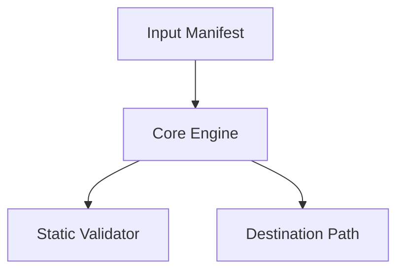

# Specification Contract: {{FEATURE_NAME}}

## 1. Overview & Context

- **Feature**: {{FEATURE_NAME}}
- **Status**: Draft / Approved / Implemented
- **Owner**: {{OWNER_OR_OPERATOR}}
- **Last Updated**: {{TIMESTAMP}}

### Summary
{{EXECUTIVE_SUMMARY_2_TO_3_SENTENCES}}

### Goals
- {{GOAL_1}}
- {{GOAL_2}}
- {{GOAL_3}}

### Non-Goals
- {{NON_GOAL_1}}
- {{NON_GOAL_2}}

---

## 2. Negative Invariants (Mandatory Prohibitions)

*Strict negative constraints defining what this component and its implementer are forbidden to do. These prevent catastrophic side effects, unintended fanout, and permission degradation.*

- NEVER {{FORBIDDEN_ACTION_1_E_G_STRIP_FILE_PERMISSIONS_OR_UID_GID}}
- NEVER {{FORBIDDEN_ACTION_2_E_G_OVERWRITE_WITH_EMPTY_PLACEHOLDERS}}
- NEVER {{FORBIDDEN_ACTION_3_E_G_USE_SYSTEMD_REQUIRES_ON_NON_CRITICAL_DEPS}}
- NEVER {{FORBIDDEN_ACTION_4_E_G_MUTATE_OUTSIDE_TARGET_DIRECTORY}}
- NEVER {{FORBIDDEN_ACTION_5_E_G_EXECUTE_DESTRUCTIVE_WRITES_IN_DRY_RUN}}

---

## 3. Boundary Commitments

### This Spec Owns
- **Authoritative Capabilities**: {{CAPABILITIES_THIS_SPEC_PROVIDES}}
- **State & Files**: {{EXACT_FILES_AND_PATHS_OWNED_AS_EXCLUSIVE_WRITER}}
- **Public Contracts**: {{SCHEMAS_CLI_INTERFACES_OR_APIS_STABILIZED}}

### Out of Boundary
- **Adjacent Responsibilities**: {{NEIGHBOR_COMPONENTS_HANDLING_RELATED_WORK}}
- **Deferred Scope**: {{ITEMS_EXPLICITLY_DEFERRED_TO_LATER_SPECS}}
- **Forbidden Creep**: {{CONVENIENCES_THAT_MUST_NOT_BE_ABSORBED}}

### Allowed Dependencies
- **System Binaries & Tools**: {{ALLOWED_CLI_BINARIES}}
- **Libraries / Packages**: {{PERMITTED_LIBRARIES_PREFER_STD_LIB}}
- **Filesystem Access**: Read-only: `{{RO_PATHS}}` | Write: `{{WO_PATHS}}`
- **Network Access**: None / Localhost only / Specific endpoints

### Revalidation Triggers
- {{CONDITION_REQUIRING_RETESTING_OR_DOWNSTREAM_REVALIDATION_1}}
- {{CONDITION_REQUIRING_RETESTING_OR_DOWNSTREAM_REVALIDATION_2}}

---

## 4. Architecture & Technical Design

### Pattern & Component Seams
{{BRIEF_EXPLANATION_OF_ARCHITECTURE_PATTERN}}



### Technology Stack & Dependencies
| Layer | Technology | Role | Dependency Policy |
|-------|------------|------|-------------------|
| Runtime | {{LANG_OR_SHELL}} | {{RUNTIME_ROLE}} | {{STANDARD_LIBRARY_OR_MINIMAL}} |
| System | {{SYSTEM_TOOL}} | {{SYSTEM_ROLE}} | {{SYSTEM_BINARY_PATH}} |

### Interfaces & Contracts
```typescript
// Or Python dataclass / JSON schema / CLI arguments definition
interface {{CONTRACT_NAME}} {
  // Concrete field definitions
}
```

---

## 5. File Structure Plan

*Map concrete files to single responsibilities before writing code.*

```text
{{PROJECT_ROOT}}/
|-- {{PATH_TO_FILE_1}}    # Single responsibility: {{RESPONSIBILITY_1}}
|-- {{PATH_TO_FILE_2}}    # Single responsibility: {{RESPONSIBILITY_2}}
\-- {{PATH_TO_TEST}}      # Verification suite: {{TEST_RESPONSIBILITY}}
```

### Files Created or Modified
- `{{PATH_TO_FILE_1}}`: {{DETAILS_OF_CHANGES}}
- `{{PATH_TO_FILE_2}}`: {{DETAILS_OF_CHANGES}}

---

## 6. EARS Requirements & Acceptance Criteria

*All requirements use EARS syntax with numbered acceptance criteria (`AC-01`, `AC-02`, etc.).*

### Requirement 1: {{REQUIREMENT_1_TITLE}}
**Objective**: As a {{ROLE}}, I want {{CAPABILITY}}, so that {{BENEFIT}}.

- `AC-01`: When {{EVENT}}, the {{SYSTEM}} shall {{ACTION}}.
- `AC-02`: If {{TRIGGER_OR_ERROR}}, the {{SYSTEM}} shall {{ACTION}}.
- `AC-03`: While {{PRECONDITION}}, the {{SYSTEM}} shall {{ACTION}}.

### Requirement 2: {{REQUIREMENT_2_TITLE}}
**Objective**: As a {{ROLE}}, I want {{CAPABILITY}}, so that {{BENEFIT}}.

- `AC-04`: When {{EVENT}}, the {{SYSTEM}} shall {{ACTION}}.
- `AC-05`: Where {{OPTION_ENABLED}}, the {{SYSTEM}} shall {{ACTION}}.
- `AC-06`: The {{SYSTEM}} shall {{UBIQUITOUS_INVARIANT}}.

---

## 7. Error Handling & Failure Modes

- **Validation Failure**: If inputs violate constraints, the system shall abort with exit code 1 and emit a human-readable diagnostic.
- **Permission Fault**: If target permissions or ACLs cannot be preserved, the system shall halt before writing changes.
- **Execution Recovery**: Incomplete operations must leave existing state unmodified.
- **Operational Runtime Limits**: Where applicable, declare performance targets (steady-state duration) separately from enforceable safety ceilings (hard timeout circuit breakers).

---

## 8. Testing & Verification Strategy

*Verification must be deterministic, reproducible, and cover both positive paths and negative invariants.*

### Automated Test Suite
- Test harness: `{{TEST_RUNNER_E_G_PYTEST_OR_BASH_TESTS}}`
- Target test file: `{{PATH_TO_TEST_FILE}}`

### Verification Test Cases
1. **Happy Path**: Verifies `AC-01`, `AC-04`.
2. **Negative Invariant Tests**: Verifies that forbidden actions (`NEVER ...`) are actively caught and rejected.
3. **Dry-Run Determinism**: Verifies `AC-03` leaves filesystem bit-for-bit identical.

### Execution Command
```bash
{{DETERMINISTIC_TEST_COMMAND}}
```
